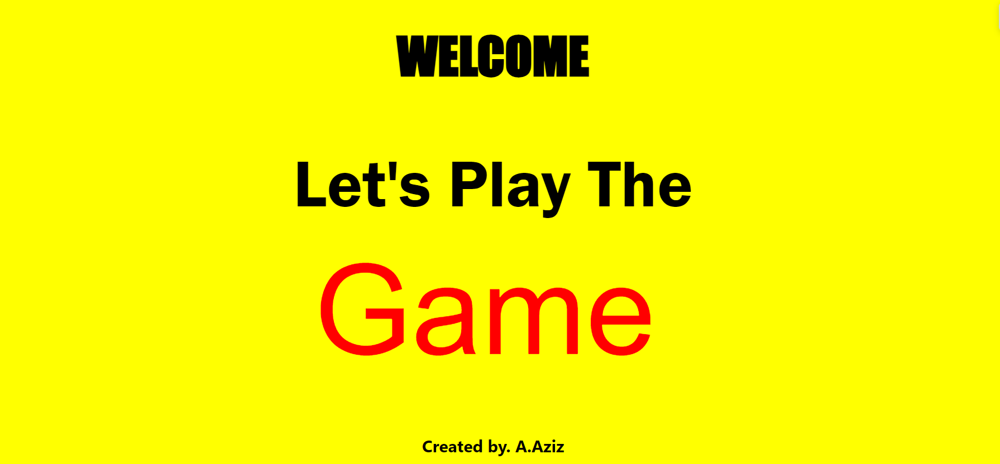
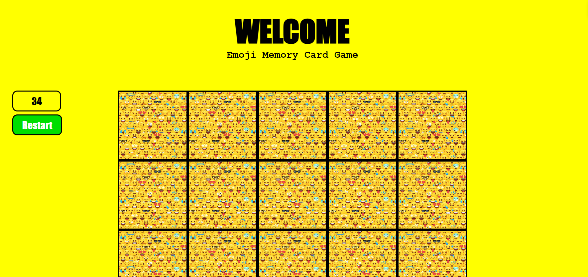

# Emoji - MC-Game - A.Aziz
## 6/9/2024
### Emoji memory card game - created by : A.Aziz

### ***Description***
#### My first Project in the Software Engineering Bootcamp, I would be programming an memory game. A Memory Game is a classic card game that tests players' memory skills and ability to match similar objects with eachother under a specific time-frame.

#### The first player turns over 2 cards. If the pictures match, the player keeps the cards and tries again for another match. If they do not match the cards are turned over again and the player to the left takes a turn. Each player must try to remember where they have seen cards, so they can use them to make a match.

---

### Technologies implemented

- Hyper Text Markup Language (HTML)
- Cascading Style Shets (CSS)
- JavaScript (JS)

### ScreenShots 
#### Image-1

#### Image-2

### Credits:

##### Images Source: [Background Image](https://t4.ftcdn.net/jpg/03/61/93/45/360_F_361934573_ftbloadKJ4ydVMMjY9jBX6SMmtRbU3yz.jpg)

##### Emojis : [Emojis](https://www.pinterest.com/emilylovehugyou/pictures-of-emojis/)